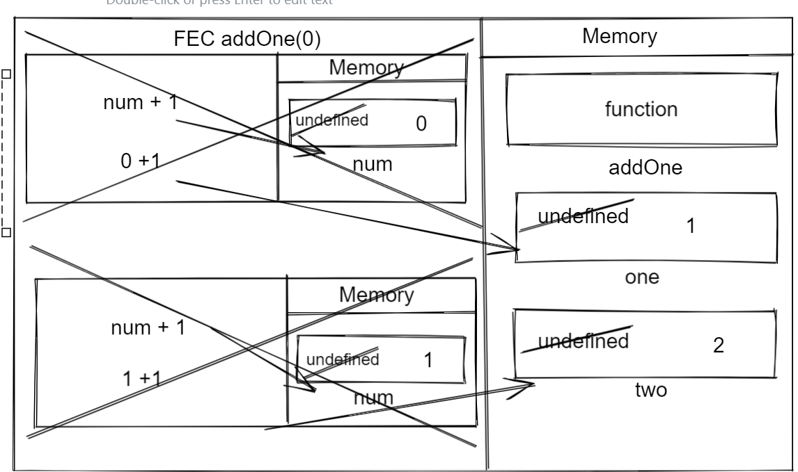
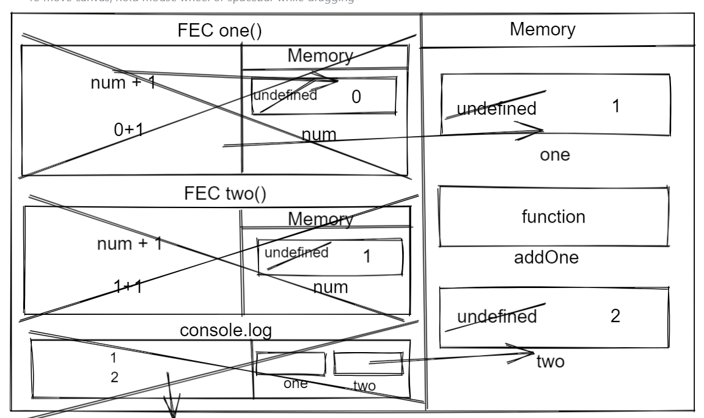
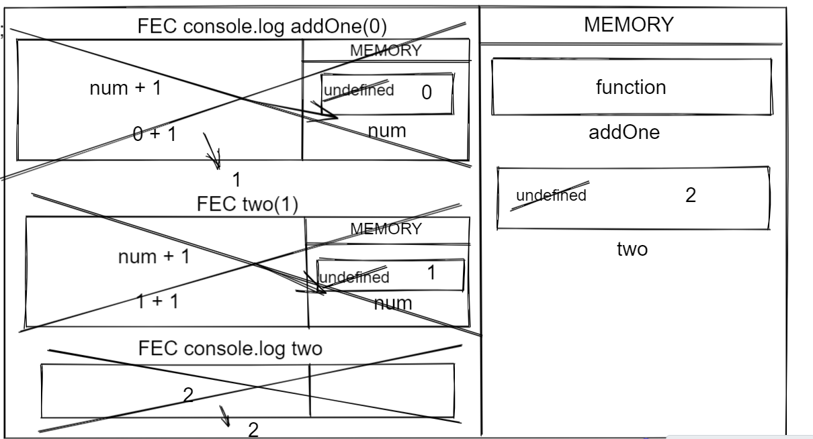
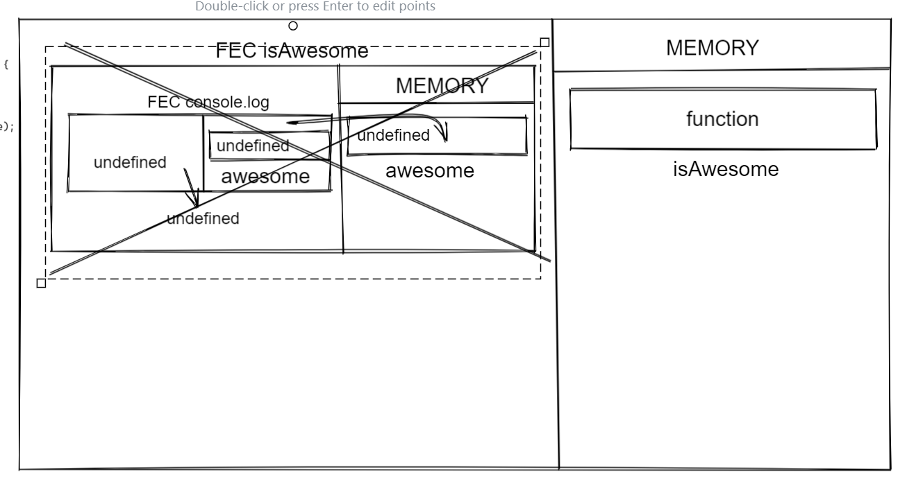

## Understanding Scope and the difference between var, let and const

Watch this video before doing the exercise: https://www.youtube.com/watch?v=XgSjoHgy3Rk

1. Guess the output:

```js
let firstName = 'Arya';
const lastName = 'Stark';
var knownAs = 'no one';

console.log(
  window.firstName, // undefined
  window.lastName, // undefined
  window.knownAs // no one
);
```

2. Guess the output:

```js
let firstName = 'Arya';
const lastName = 'Stark';
var knownAs = 'no one';

function fullName(a, b) {
  return a + b;
}

console.log(window.fullName(firstName, lastName)); // AryaStark
```

3. Make a Execution Context Diagram for the following JS and write the output.

```js
fucntion addOne(num){
  return num + 1;
}
var one = addOne(0);
var two = addOne(1);
console.log(one, two); // 1 2
```


4. Make a Execution Context Diagram for the following JS and write the output.

```js
var one = addOne(0);
fucntion addOne(num){
  return num + 1;
}
var two = addOne(1);
console.log(one, two);
```




5. Make a Execution Context Diagram for the following JS and write the output.

```js
console.log(addOne(0)); // 1
fucntion addOne(num){
  return num + 1;
}
var two = addOne(1); 
console.log(two); // 2
```



6. Make a Execution Context Diagram for the following JS and write the output.

```js
var one = addOne(0);
const addOne = (num) => {
  return num + 1;
};
var two = addOne(1);
console.log(two);
```
addOne' has already been declared




7. Make a Execution Context Diagram for the following JS and write the output.

```js
console.log(addOne(0));
const addOne = (num) => {
  return num + 1;
};
var two = addOne(1);
console.log(two);
```
addOne' has already been declared

8. What will be the output of the following

```js
function isAwesome() {
  var awesome;
  if (false) {
    awesome = true;
  }
  console.log(awesome);
}
isAwesome();
```

undefined

9. What will be the output of the following

```js
function isAwesome() {
  let awesome;
  if (true) {
    awesome = true;
  }
  console.log(awesome);
}
isAwesome();
```

10. What will be the output of the following

```js
function isAwesome() {
  let awesome;
  if (false) {
    awesome = true;
  }
  console.log(awesome);
}
isAwesome();
```
true

11. What will be the output of the following

```js
let firstName = 'Arya';
const lastName = 'Stark';
var knownAs = 'no one';

function fullName(a, b) {
  return a + b;
}
const name = fullName(firstName, lastName);
console.log(name); // AryaStark
```

12. Guess the output of the code below with a reason.

```js
function sayHello() {
  let name = 'Arya Stark';
}
sayHello();

console.log(name);
```
undefined

name is defined using the keyword let inside the function scope therefore we cannot access let from outside the block or function scope.

13. Guess the output of the code below with a reason.

```js
if (true) {
  var name = 'Arya Stark';
}
console.log(name); // Arya Stark
```
name is defined a block scope but we can acess it from outside becuase it has been declared using the var keyword which is a function scope only.

14. Guess the output of the code below with a reason.

```js
if (true) {
  let name = 'Arya Stark';
}
console.log(name);  // undefined
```
We cannot access the variable name from outside the block scope because it has been defined using the let keyword.

15. Guess the output of the code below with a reason.

```js
for (var i = 0; i < 20; i++) {
  //
}
console.log(i); // 20
``` 
We can access i from outside the scope only because it has been defined using the var keyword.

16. Guess the output of the code below with a reason.

```js
for (let i = 0; i < 20; i++) {
  //
}
console.log(i); // ReferenceError - i is not defined
```

We cannot access i from outside because i has been defined using the keyword let which is a block scope.

17. Guess the output and the reason behind that.

```js
function sample() {
  if (true) {
    var username = 'John Snow';
  }
  console.log(username);
}
sample(); // John Snow
```
We can access username inside the block scope because it has been defined using the var keyword.

18. Guess the output and the reason behind that.

```js
function sample() {
  if (true) {
    let username = 'John Snow';
  }
  console.log(username);
}
sample(); // ReferenceError - username is not defined
```

We cannot acces username inside the block scope because of the let keyword.

19. Guess the output and the reason behind that.

```js
function sample() {
  var username = 'Arya Stark';
  if (true) {
    var username = 'John Snow';
    console.log(username);
  }
  console.log(username, 'second');
}
sample(); // John Snow 
// John Snow second
```
We can access the username inside the block scope using the var keyword.

20. Guess the output and the reason behind that.

```js
function sample() {
  let username = 'Arya Stark';
  if (true) {
    let username = 'John Snow';
    console.log(username, 'first');
  }
  console.log(username, 'second');
}
sample(); // John Snow first
// Arya Stark second
```
We can access the username variable defined outside the block scope because the variable can bubble out for the value and then use it inside the scope however it is not possible the other way.

21. Guess the output and the reason behind that.

```js
function sample(...args) {
  for (let i = 0; i < args.length; i++) {
    let message = `Hello I am ${args[i]}`;
    console.log(message);
  }
}

sample('First', 'Second', 'Third');
// Hello I am First
// Hello I am Second
// Hello I am Third
```
We can access message and args because they all are under the scope.

22. Guess the output and the reason behind that.

```js
function sample(...args) {
  for (let i = 0; i < args.length; i++) {
    const message = `Hello I am ${args[i]}`;
    console.log(message);
  }
}

sample('First', 'Second', 'Third');
// Hello I am First
// Hello I am Second
// Hello I am Third
```
We can access message and args because they all are under the scope.

23. Guess the output and the reason behind that.

```js
if (true) {
  const myFunc = function () {
    console.log(username, 'Second');
  };
  console.log(username, 'First');
  let username = 'Hello World!';
  myFunc();
}
// ReferenceError: Cannot access 'username' before initialization+
```
We are tryiing to access the username which is defined inside a function scope.

24. Guess the output and the reason behind that.

```js
function outer() {
  let movie = 'Mad Max: Fury Road';
  function inner() {
    console.log(
      `I love this movie called ${movie.toUpperCase()}`
    );
  }
  inner();
}

outer(); // I love this movie called MAD MAX: FURY ROAD
```
We can bubble out of the scope for the variable movie.

25. Guess the output and the reason behind that.

```js
function outer() {
  let movie = 'Mad Max: Fury Road';
  function inner() {
    let movie = 'Before Sunrise';
    console.log(
      `I love this movie called ${movie.toUpperCase()}`
    );
  }
  inner();
}

outer(); // I love this movie called BEFORE SUNRISE
``` 
We can bubble out of the scope for the variable movie.


26. Guess the output and the reason behind that.

```js
function outer() {
  let movie = 'Mad Max: Fury Road';
  function inner() {
    let movie = 'Before Sunrise';
    function extraInner() {
      let movie = 'Gone Girl';
      console.log(
        `I love this movie called ${movie.toUpperCase()}`
      );
    } 
    extraInner();
  }
  inner();
}
outer(); // I love this movie called GONE GIRL
```

30. Using reduce find the final value when the initial value passed is `100`. You have to pass the output of one function into the input of next function in the array `allFunctions` starts with `addOne` ends with `half`.

```js
const addOne = (num) => {
  return num + 1;
};
const subTwo = (num) => {
  return num - 2;
};
const multiplyThree = (num) => {
  return num * 3;
};
const half = (num) => {
  return num / 2;
};

let allFunctions = [
  addOne,
  subTwo,
  multiplyThree,
  addOne,
  multiplyThree,
  half,
];

// Answer is: 447
```
